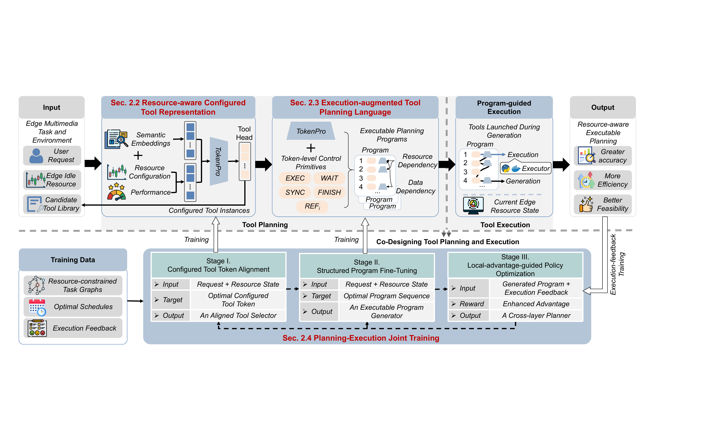

# CoPE: Co-designing Tool Planning and Execution

This repository is the open-source codebase of **CoPE**, a unified framework for resource-aware tool planning and execution on edge systems.

Following the paper, CoPE is built around three ideas:

- **Resource-aware configured tool representation**: tools are modeled with both functional semantics and resource-performance semantics.
- **Execution-augmented tool planning language**: planning is represented as executable programs with control primitives, instead of static tool lists.
- **Planning-execution joint training**: the model is optimized in three stages to handle dynamic resource constraints and large decision spaces.



## Paper-Aligned Overview

Given a user request, current system resource state, and candidate tool library, CoPE first tokenizes tools into configured instances, then generates executable planning programs, and finally refines policy quality with execution feedback.

The training pipeline is:

- **Stage 1: Configured Tool Token Alignment**
- **Stage 2: Structured Program Fine-Tuning**
- **Stage 3: Local-advantage-guided Policy Optimization (`lag-grpo`)**

This repository implements the above three-stage pipeline and the corresponding offline inference entrypoint.

## Code Structure

Implementation is organized to map directly to paper components:

- `src/cope/stage1/`: configured tool token alignment, tokenizer expansion, and Stage1 collapse export.
- `src/cope/stage2/`: structured program fine-tuning with Stage1 collapsed tensors as frozen components.
- `src/cope/stage3/`: `lag-grpo` policy optimization with execution-aware reward modeling.
- `src/cope/inference/`: inference interface for Stage2/Stage3 models.
- `src/cope/common/`: shared configuration/runtime utilities.
- `configs/stage1/`, `configs/stage2/`, `configs/stage3/`, `configs/infer/`: stage-specific experiment configs.
- `scripts/stage1/`: thin wrappers for Stage1 asset preparation and collapse postprocess.

Data and checkpoint paths follow numbered stage namespaces:

- `data/00_global`, `data/01_stage1`, `data/02_stage2`, `data/03_stage3`
- `checkpoints/01_stage1`, `checkpoints/02_stage2`, `checkpoints/03_stage3`

## Interfaces

Unified Python entrypoints:

```bash
python train.py --stage stage1 --config configs/stage1/stage1_qwen25_7b.yaml
python train.py --stage stage2 --config configs/stage2/stage2_qwen25_7b.yaml
python train.py --stage stage3 --config configs/stage3/stage3_qwen25_7b_lag_grpo.yaml
```

inference:

```bash
python infer.py --stage stage2 --config configs/infer/infer_stage2.yaml --input data/sample.json --output outputs/stage2_pred.json
python infer.py --stage stage3 --config configs/infer/infer_stage3.yaml --input data/sample.json --output outputs/stage3_pred.json
```

## Makefile Usage

`Makefile` provides stage-level training commands:

```bash
# Stage1 full pipeline:
# tokenizer -> input check -> train -> collapse
make stage1

# Stage2 training
make stage2

# Stage3 lag-grpo training
make stage3
```

Useful Stage1 sub-commands:

```bash
make stage1-tokenizer
make stage1-check
make stage1-train
make stage1-collapse
```

Override device or config when needed:

```bash
make stage2 CUDA_VISIBLE_DEVICES=3 STAGE2_CONFIG=configs/stage2/stage2_qwen25_7b.yaml
make stage3 CUDA_VISIBLE_DEVICES=3 STAGE3_CONFIG=configs/stage3/stage3_qwen25_7b_lag_grpo.yaml
```

## Base Models

Mainline configs currently target:

- `/AI/HF_MODELS/Qwen2.5-3B`
- `/AI/HF_MODELS/Qwen2.5-7B`
